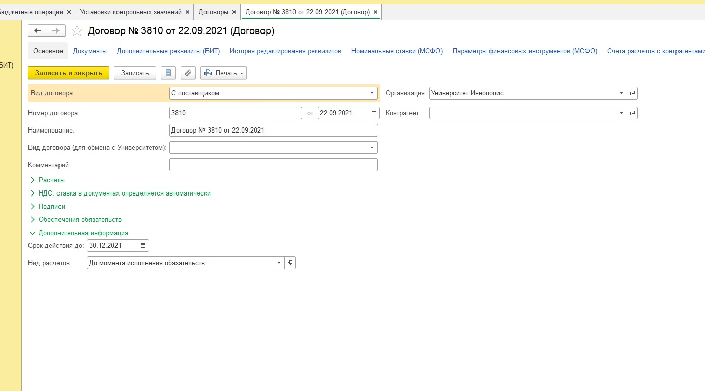
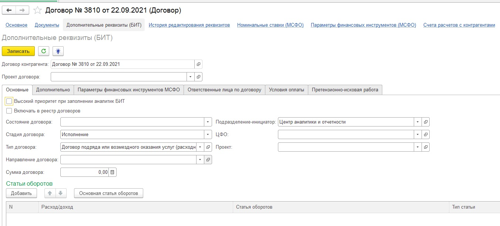
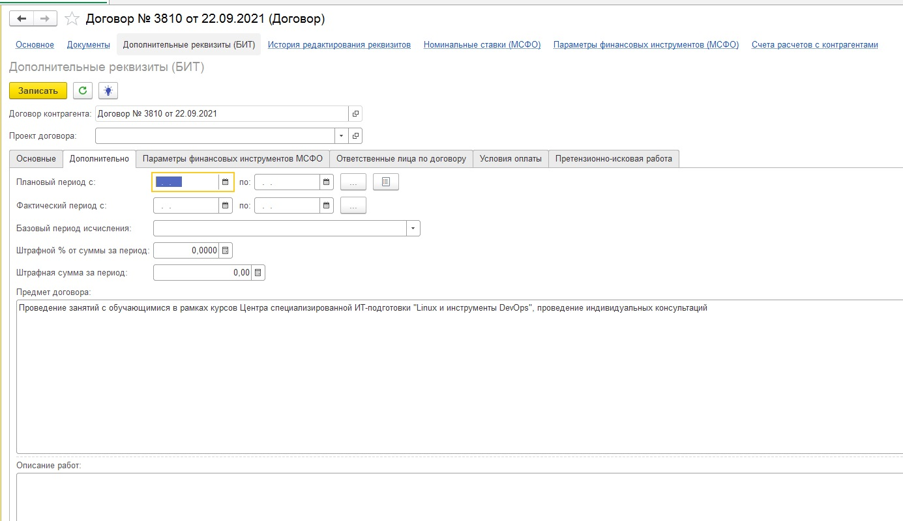
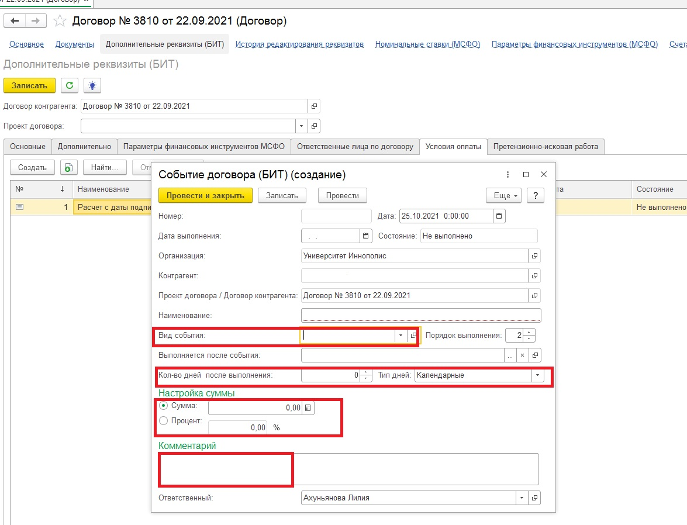
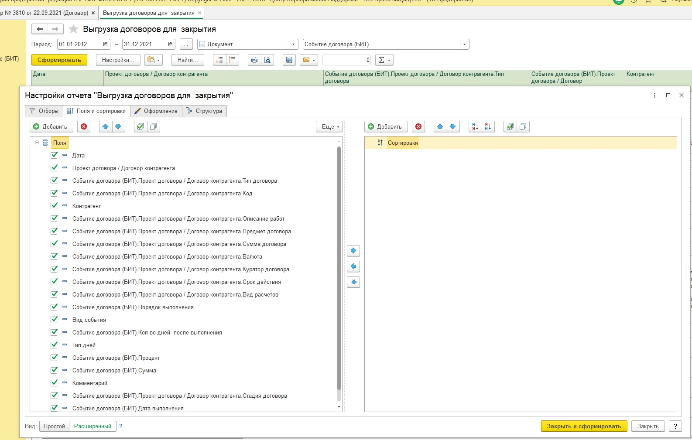
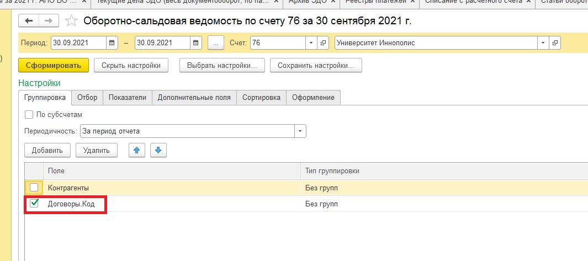

# Contract_work
Необходимо обновлять реестр рамочных договоров с поставщиками и всех договоров с покупателями, оставляя только действующие на текущий момент договоры. 
## Входные данные
1. Выгрузка договоров.xlsx - файл, содержащий перечень договоров, по которым заполнены данные в 1С. 
В 1С заводится подобным образом карточка договора

Также заполняются дополнительно вкладки:
    1. "Основные": сумма проставляется только в разовых договорах или договорах, по которым предусмотрено заключений дополнений к договорам (спецификаций, приложений и т.д.)
    
    2. "Дополнительно": описание работ заполняется только для разовых договоров
    
    3. "Условия оплаты":
        1. вид события выбирается из справочника
        2. кол-во дней после выполнения и тип дней заполняются всегда, за исключением, если выбран вид события - Расчет по графику платежей, Предоплата/Расчет до конкретной даты
        3. сумма или процент - взаимоисключающие поля, заполняется что-то одно
        4. комментарий заполняется 2 видами: Оплата по договору либо Спецификация / Приложение/ Заявка необходимы
        
    
Для того, чтобы выгрузить все заполненные данные по договорам, можно использовать Универсальный отчет из 1С. Настройки приведены ниже.

2. ОСВ 60.xlsx, ОСВ 62.xlsx, ОСВ 76.xlsx - отчеты в 1С - оборотно-сальдовая ведомость (ОСВ) по счетам 60, 62, 76 с группировкой договоров по кодам (код - уникальный идентификатор договора в 1С).

4. Выгрузка всех договоров.xls - выгрузка справочника "Договоры" из 1С с обязвательнями полями *Контрагент*, *ИНН*.
5. 
## Техника решения
### Проверка заполнения
Вначале необходимо убедиться, что все поля заполнены правильно. Поэтому данная часть кода позволяет:
1. проверить заполнены ли столбцы *Тип договора*, *Предмет договора*, *Комментарий*, *Стадия договора*, 
```
(data[fields[2]].isna()) | (data[fields[6]].isna()))|
(data[fields[18]].isna()) | (data[fields[19]].isna())
```        
2. заполнено ли какое-либо из полей *Срок действия* или *Вид расчетов*
```
((~data[fields[10]].isna()) & (~data[fields[11]].isna()))
```
3. кол-во дней должно быть заполнено, только если видом события не является один из трех: Расчет по графику платежей, Предоплата/Расчет до конкретной даты
```
((~data[fields[13]].isin(type_pmnt_sched)) & (~data[fields[13]].isin(type_pmnt_to_date)) 
& (data[fields[14]].isna()))
```
4. при выборе вида события -  Предоплата/Расчет до конкретной даты должна быть заполнены *Дата выполнения*
```
((data[fields[13]].isin(type_pmnt_to_date)) & (data[fields[20]].isna()))
```
5. одно из полей *Дата выполнения* или *Кол-во дней после выполнения* должно быть заполнено
```
((~data[fields[14]].isna()) & (~data[fields[20]].isna()))
```
6. одно из полей *Сумма* или *Процент* должно быть заполнено, только если видом события не является Расчет по графику платежей
```
((data[fields[16]].isna()) & (data[fields[17]].isna()) & (~data[fields[13]].isin(type_pmnt_sched)))|
((~data[fields[16]].isna()) & (~data[fields[17]].isna()))
```
7.сумма не должна равняться 10 (для ввода условий оплаты 1С требует заполнить поле *Сумма*, поэтому общим маркером принято считать цифру 10 - как обозначающую, что сумму заполнили только для заполнения дальнейших полей), которую ввиду человеческого фактора иногда можно забыть убрать
```
(data[fields[7]] == 10)
```
8. *Комментарий* должен быть заполнен либо как Оплата по договору либо Спецификация / Приложение/ Заявка необходимы, ввиду того, что она заполняется вручную, возможны ошибки
```
(~data[fields[18]].isin(req_adds))
```
### Автоматическое закрытие старых договоров
Закрытие договора происходит по 2 аспектам: окончание срока действия и исполнение обяазетельств. 
1. Окончание срока действия определяется путем сравнения текущей даты со сроком действия незакрытого договора.
```
curr_date = datetime.now()
date = pd.to_datetime(data[fields[10]], dayfirst=True)
data[fields[10]] = date
data_toclose = data[(data[fields[19]] != 'Закрыт') &
            (data[fields[10]] < curr_date)]
```
2. Оценить исполнение обязательств возможно при помощи ОСВ.

Для оценки исполнения обязательств по договорам с поставщиками понадобится сформировать ОСВ по счетам 60 и 76, с покупателями - 62 и 76.
Чтобы закрыть исполненные договоры с поставщиками выбираем из файла Выгрузка договоров.xlsx следующие типы договоров:
    1. Договор подряда или возмездного оказания услуг (расходный)
    2. Договор купли-продажи (расходный)
    3. Договор-счет, оферта (не требует подписания)
    4. Договор аренды
```
type_cntr_suplly = ['Договор подряда или возмездного оказания услуг (расходный)', 'Договор купли-продажи (расходный)',
                    'Договор-счет, оферта (не требует подписания)', 'Договор аренды']
data_OSV = data[data[fields[2]].isin(type_cntr_suplly)]
```
Необходимо отобрать из списка незакрытые договоры с видом расчетов - *До момента исполнения обязательств*
```
data_OSV = data_OSV[(data_OSV[fields[11]] == 'До момента исполнения обязательств') & (data_OSV[fields[19]] != 'Закрыт')]
```
Совмещением файлов data_OSV и OSV (ОСВ 60 и 76 счетов при закрытии договоров с поставщиками, ОСВ 62 и 76 счетов при закрытии договоров с покупателями) отбираем договоры, у которых отсутствуют остатки по счетам (*Сальдо_Дебет*, *Сальдо_Кредит*), а также сумма оборотов не меньше суммы договора.
```
data_turn = data_OSV.merge(OSV, how = 'left', left_on=fields[3],right_on='Договоры_Код')
data_turn = data_turn[(data_turn['Сальдо_Дебет'].isna()) & (data_turn['Сальдо_Кредит'].isna())] 
data_turn = data_turn[(data_turn['Обороты за период_Дебет'] > data_turn[fields[7]]) | 
                      (data_turn['Обороты за период_Дебет'] == data_turn[fields[7]])]
```
Аналогично происходит поиск недействующих договоров с покупателями.
По договорам, у которых *Вид договора* - Прочее проверка на исполнение реализована пока исключительно по сроку действия, т.к. в подобных договорах обычно исполнение определяется только сроком действия. 
### Обновление реестра рамочных договоров
Реестр рамочных договоров с поставщиками представляет собой таблицу со столбцами:
  1. Контрагент
  2. ИНН
  3. Плательщик/ Неплательщик НДС - является ли контрагент плательщиком или неплательщиком НДС
  4. Договор - реквизиты договора
  5. Вид товаров / работ / услуг - установленный перечень видов внутри компании
  6. История произведенных закупок - наименование наиболее часто закупаемых позиций по договору
  7. Срок действия - срок окончания действия договора
  8. Ответственное подразделение - подразделение, закрепленное ответственным за некоторые виды товаров / работ/ услуги
  9. Ссылка на договор - ссылка на согласование договора внутреннего документооборота

Рамочный договор исходя из практики компании - в основном это договор, по которому сумма не прописана в самом договоре и при этом условиями договора не предусмотрено заключение спецификаций (*Комментарий* - Оплата по договору), а также договор, условиями которого предусмотрено заключение спецификаций, приложений, заявок к договору.
```
data = data[(data[fields[2]].isin(type_cntr_suplly)) &
            (data[fields[19]] == 'Исполнение') & 
            (((data[fields[18]] == 'Оплата по договору') & (data[fields[7]].isna())) | 
            (data[fields[18]] == 'Спецификация / Приложение/ Заявка необходимы')) |
            (data['Проект договора / Договор контрагента'].isin(exc_cntr))]
```
В список exc_cntr можно добавить договоры, которые являются рамочными, но не удовлетворяют условию выше.
Чтобы обновить реестр, необходимо:
  1. обновить срок действия договоров, уже включенных в реестр
  2. добавить ИНН по новым договорам (ИНН берется из файла Выгрузка всех договоров.xlsx)
  3. Плательщик/ Неплательщик НДС, Вид товаров / работ / услуг, История произведенных закупок, Ссылка на договор - пока заполняется вручную по вновь добавляемым договорам

1.Обновление срока действия договора.

По уже имеющимся в реестре рамочных договоров позициям необходимо обновить срок действия договора. После объединения файлов Выгрузка договоров.xlsx и Реестр поставщиков.xlsx выбираем те договоры, у которых заполнено либо *Срок действия*, либо *Вид расчетов*, и заполняем новый столбец *Срок действия*. Датасет, в котором заполнено ИНН (этот столбец есть только в Реестре поставщиков.xlsx ), обновляем путем отбора нужных столбцов.
```
new_reg = reg.merge(data, how = 'outer', left_on='Договор',right_on='Проект договора / Договор контрагента')
new_reg = new_reg[(~new_reg[fields[10]].isna()) | (~new_reg[fields[11]].isna())]
new_reg['Срок действия'] = new_reg[[fields[10], fields[11]]].fillna('').sum(axis=1)
upd = new_reg[~new_reg['ИНН'].isna()]
upd = upd.rename(columns={'Контрагент_x':'Контрагент'})
upd = upd[['Контрагент', 'ИНН', 'Плательщик НДС','Договор', 'Вид товаров / услуг / работ', 'История произведенных закупок','Срок действия',
           'Ответственное подразделение', 'Ссылка на договор']]
```
2.Добавление ИНН по новым договорам.

Для добавления данных по ИНН необходимо объединить фыйл Выгрузка всех договоров.xlsx и датасет n_reg
```
n_reg = new_reg[new_reg['ИНН'].isna()]
n_reg = n_reg.drop_duplicates(subset=[fields[3]])
n_reg = n_reg[['Контрагент_y','ИНН', 'Плательщик НДС', fields[1], fields[5], fields[6], 
               'Срок действия', 'Ответственное подразделение', 'Ссылка на договор']]
new = n_reg.merge(inn, how = 'left', left_on='Контрагент_y', right_on='Контрагент')
new = new[['Контрагент_y', 'ИНН_y', 'Плательщик НДС', fields[1], fields[5], fields[6], 
               'Срок действия', 'Ответственное подразделение', 'Ссылка на договор']]
```
Из полученного списка можно исключить договоры по определенным контрагентам, наименованиям, опредленным словам в наименовании договора, в предмете договора.
```
new = new[(~new['Контрагент'].isin(exc_list)) &
          (~new ['Договор'].isin(exc_list)) &
          (~new['Договор'].str.contains('|'.join(name_exc))) & 
          (~new['Предмет договора'].str.contains('|'.join(subj_exc)))]
```
